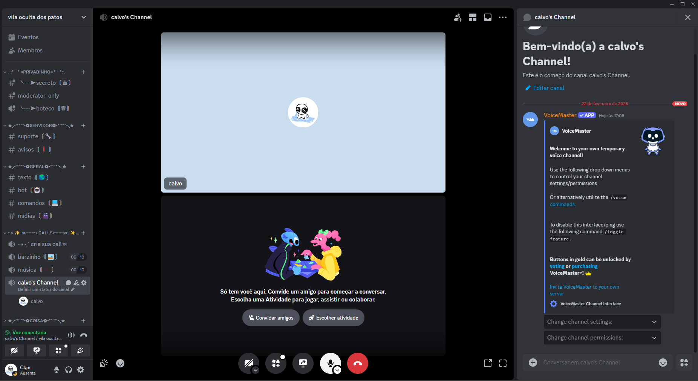

# Discord Voice Channel Manager Bot

Este projeto é um bot do Discord que permite aos administradores gerenciar canais de voz personalizados dentro de um servidor. Os administradores podem adicionar, listar e remover canais de voz personalizados de maneira fácil e intuitiva.

## Funcionalidades

- **Adicionar Canal de Voz**: Permite que administradores adicionem canais de voz personalizados para criação.
- **Listar Canais de Voz**: Lista todos os canais de voz personalizados existentes em um servidor.
- **Remover Canal de Voz**: Permite que administradores removam canais de voz da lista de canais personalizados.


## 🛠️ Requisitos

Antes de começar, certifique-se de ter o seguinte:

- Python 3.8 ou superior
- Biblioteca Discord.py (Instale usando `pip install discord.py`)
- Um Token de Bot do Discord

## 🔧 Configuração

1. **Clone o Repositório**:

   ```bash
   git clone https://github.com/ualcz/Discord_Cards.git
   cd discord-voice-bot
   ```

2. **Instale as Dependências**:

   Certifique-se de ter os pacotes necessários instalados:

   ```bash
   pip install -r requirements.txt
   ```

3. **Crie um Arquivo `.env`**:

   No diretório raiz do seu projeto, crie um arquivo chamado `.env` e adicione seu token de bot do Discord e a link para seu servidor postgresql:

   ```plaintext
   TOKEN=seu_token_do_bot_discord
   DATABASE_URL=seu_link
   ```

   Substitua `seu_token_do_bot_discord` pelo seu token real do bot do Discord `seu_link` pelo link para seu servidor postgresql.

## 🕹️ Como Executar o Bot

Para iniciar o bot, execute o seguinte comando:

```bash
python Main.py
```

Certifique-se de que seu arquivo `.env` esteja configurado com o token do seu bot para que funcione corretamente.

---
## 📄 Licença

Este projeto está licenciado sob a Licença MIT - consulte o arquivo [LICENSE](LICENSE) para mais detalhes.

---
Contribuições são bem-vindas! Se você tiver sugestões para melhorias ou novos recursos, por favor, abra uma issue ou envie uma solicitação de pull ou entre em contato com [Clau] em [Claudeilsonsouzza@gmail.com] para mais informações.